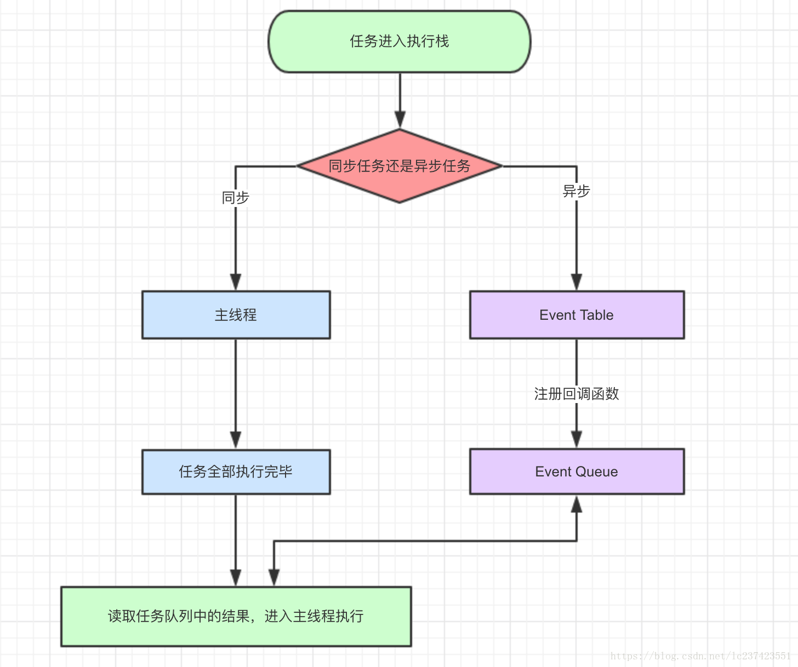
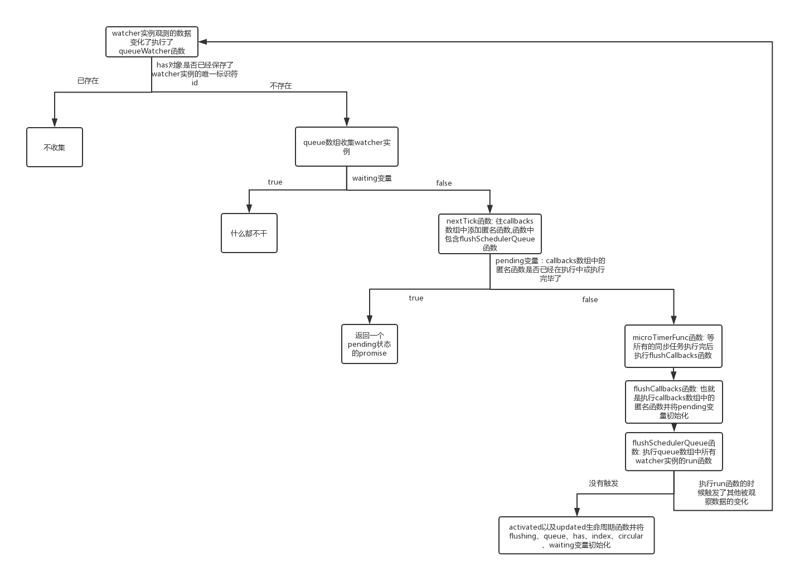

# 异步更新队列
前面提到过,当我改变数据时,会触发这个数据私有`Dep`实例收集到的`watcher`实例的`update`方法.而这个函数中对计算属性做了特殊处理,对计算
属性进行了同步求值并对值更新后通知订阅其的`watcher`实例进行更新或者属性`sync`为`true`的`watcher`实例也进行同步更新值。唯独对既不是
计算属性也不需要强制同步更新的`watcher`实例会放入一个异步队列中,也就是执行的`queueWatcher`函数.为什么要单独拿不来讲,而不在讲响应式
的时候讲,主要是因为我觉得这个应该单独成为一章内容,而且其还包含其他一些知识点。

## queueWatcher
```ecmascript 6
let queue = [];
let has = {};
let circular= {};
let waiting = false;
let flushing = false;
let index = 0;
```
这几个变量是在引入`queueWatcher`函数时初始化的,这里先说下这个几个的作用.

   - `has`: 用于收集进入队列的观察者实例的唯一标识符,主要是为了防止重复收集。
   - `flushing`: 用于了解队列中的观察者实例是否已经在执行其`update`函数,如果还未执行则添加进队列的尾部,否则添加到比新添加进队列的
                 `watcher`实例唯一标识符小或相等的`watcher`实例后面,也就是相应的队列位置,为了保证`watcher`实例能按标识符大小循序逐一更新。
   - `circular`: 用于缓存各个`watcher`实例更新的次数,当循环更新大于100次时提示警告信息'你有一个无限的更新循环'.              
   - `waiting`: 用于确认队列中的`watcher`实例是否全部更新完毕,是否需要重新生成一个队列。 
   - `index`: 用于表示当前已经执行到队列的哪个`watcher`实例了,也就是其下标。 
   - `queue`: 收集的`watcher`实例集合
```ecmascript 6
export function queueWatcher (watcher: Watcher) {
  //获取参数传入的观察者id标识符
  const id = watcher.id
  //判断该实例是否已经在队列中
  if (has[id] == null) {
    //将该观察者实例的标识符属性设置为true,表示该观察者实例已在队列中，避免重复放入队列中
    has[id] = true
    //只有当队列没有执行更新时才会简单地将观察者追加到队列的尾部，这个flushing变量就是队列执行更新的标识符
    if (!flushing) {
      queue.push(watcher)
    } else {
      //(触发计算属性的 get 拦截器函数时会有观察者入队的行为)
      // if already flushing, splice the watcher based on its id
      // if already past its id, it will be run next immediately.
      //获取队列的最后一个项的下标
      let i = queue.length - 1
      while (i > index && queue[i].id > watcher.id) {
        i--
      }
      queue.splice(i + 1, 0, watcher)
    }
    // queue the flush
    if (!waiting) {
      waiting = true
      nextTick(flushSchedulerQueue)
    }
  }
}
```
该函数是收集`watcher`实例的第一步,其获取`watcher`实例的唯一标识符`id`,并将不在队列中的`watcher`实例放入队列中,然后通过`flushing`
变量也就是队列执行更新的标识符来判断该将新进入的`watcher`实例放入队列的什么位置,最后就是通过`waiting`变量来判断上一个执行队列是否全
部执行完毕,对执行完毕的重新生成一个执行队列,也就是执行`nextTick`函数参数为`flushSchedulerQueue`,这个函数其实就是`$nextTick`这个
`api`。

## nextTick
```ecmascript 6
const callbacks = [];
let pending = false;
export function nextTick (cb?: Function, ctx?: Object) {
  let _resolve
  //callbacks数组中添加函数(包含回调函数的函数)
  callbacks.push(() => {
    //是否存在回调函数
    if (cb) {
      try {
        //执行回调函数(因为回调函数时开发者自己定义的,所有有错误提示机制)
        cb.call(ctx)
      } catch (e) {
        handleError(e, ctx, 'nextTick')
      }
    } else if (_resolve) {
      //将Promise状态改为success
      _resolve(ctx)
    }
  })
  //判断状态是否为false
  if (!pending) {
    pending = true
    if (useMacroTask) {
      macroTimerFunc()
    } else {
      //执行微任务，也就是确保同步任务执行完后执行所有callbacks中的函数
      microTimerFunc()
    }
  }
  // $flow-disable-line
  //不存在回调并且支持Promise返回一个Promise函数(使用Promise会使当所有callbacks中的函数执行完后才会执行then中的回调)
  if (!cb && typeof Promise !== 'undefined') {
    return new Promise(resolve => {
      _resolve = resolve
    })
  }
}
```
   - `callbacks`: 收集匿名函数,其内部会执行`nextTick`函数参入的`cb`参数。
   - `pending`: 用于判断`callbacks`数组的匿名函数是否已经在执行中或执行完毕了。
   
可以看到其在`callbacks`放入的一个函数,这里先不管这个函数干什么,先接着往下看.后面是根据`pending`变量的状态来判断是否要执行微任务或宏
任务。最后对没有传入`cb`参数的`nextTick`函数返回一个执行中状态的`Promise`实例,该`Promise`成功状态也是在`callbacks`数组的匿名函数中
执行的。在这里提到了`2`个东西: 微任务和宏任务,下面来详细讲下。

   - 微任务`microTimerFunc`: `process.nextTick, Promise, Object.observe, MutationObserver`

   - 宏任务`macroTimerFunc`: `script(整体代码), setTimeout, setInterval, setImmediate, I/O, UI rendering`

也就是执行顺序: 先执行宏任务`macro-task`(也就是`script`整体代码)，然后开始执行所有的`micro-task`.当所有可执行的`micro-task`执行完毕
              之后,循环再次执行`macro-task`中的一个任务队列,执行完之后再执行所有的`micro-task`,就这样一直循环.

举个例子:
```ecmascript 6
setTimeout(() => {console.log(1)})
new Promise((res, rej) => {
    console.log(2);
    res();
}).then(_ => console.log(3))
console.log(4)
```
看看这段代码,我想都知道执行的顺序是`2-4-3-1`,但是为什么呢？首先这段代码是宏任务,前面说了`script`整体代码就是宏任务,那么同步任务也属
于宏任务,那么去执行`setTimeout`函数,同步任务嘛毋容置疑。接着其又遇到了宏任务`setTimeout`的回调函数,会将这个放入宏任务队列中,也就是
我们这里的`macroTimerFunc`.然后执行`Promise`的参数函数,这个函数也是同步任务,然后会将`then`函数放入微任务队列中,也就是`microTimerFunc`。
最后的同步任务就不讲了.等同步任务执行完了,就该执行异步任务了,那么前面提过的顺序,这个就会执行微任务队列中的任务,也就是`then`函数,这样
就一轮循环完成了.然后又是宏任务,也就是`setTimeout`的回调函数。



## microTimerFunc
```ecmascript 6
const p = Promise.resolve()
microTimerFunc = () => {
    p.then(flushCallbacks)
    /*怪异问题的变通方法，在一些 UIWebViews 中存在很奇怪的问题，即 microtask 没有被刷新，
    对于这个问题的解决方案就是让浏览做一些其他的事情比如注册一个 (macro)task 即使这个 (macro)task 什么都不做，
    这样就能够间接触发 microtask 的刷新*/
    if (isIOS) setTimeout(noop)
}
```
可以看到`microTimerFunc`函数主要是执行了一个`Promise`状态为成功之后的函数也就是`then`函数。这个也很好的体现了前面说的微任务,所以该
函数也是以`micro`命名的,充分的说明了等所有的同步事件完成之后在执行`flushCallbacks`函数。那么接着去看下`flushCallbacks`函数的代码

## flushCallbacks
```ecmascript 6
function flushCallbacks () {
  //将状态改为false
  pending = false
  //获取所有需要执行的(包含回调函数的函数)
  const copies = callbacks.slice(0)
  //清空callbacks数组
  callbacks.length = 0
  //依次执行包含回调函数的函数
  for (let i = 0; i < copies.length; i++) {
    copies[i]()
  }
}
```
可以看到其将`pending`变量初始化了也就是我前面提到的表示`callbacks`数组中的函数正在执行中了。往后面看,确实也是这样做的,其循环了
`callbacks`数组复制品`copies`变量,将`callbacks`也初始化了,并一一执行了其中的匿名函数,也包括执行了`flushSchedulerQueue`函数,
现在去看下`flushSchedulerQueue`函数

## flushSchedulerQueue
```ecmascript 6
function flushSchedulerQueue () {
  flushing = true
  let watcher, id

  // Sort queue before flush.
  // This ensures that:
  // 1. Components are updated from parent to child. (because parent is always
  //    created before the child)
  // 2. A component's user watchers are run before its render watcher (because
  //    user watchers are created before the render watcher)
  // 3. If a component is destroyed during a parent component's watcher run,
  //    its watchers can be skipped.
  /*将watcher实例按id标识进行升序排列*/
  queue.sort((a, b) => a.id - b.id)

  // do not cache length because more watchers might be pushed
  // as we run existing watchers
  for (index = 0; index < queue.length; index++) {
    //依次获取watcher实例
    watcher = queue[index]
    //存在watcher实例的before属性就执行before()
    if (watcher.before) {
      watcher.before()
    }
    //缓存watcher实例id标识
    id = watcher.id
    //将has数组中的标识清空,用来表示已经不在队列中,也就是初始化
    has[id] = null
    //执行实例的run方法(watch的回调、computed的get方法, 渲染函数的updateComponent()等等都会在run方法中执行)
    watcher.run()
    // in dev build, check and stop circular updates.
    if (process.env.NODE_ENV !== 'production' && has[id] != null) {
      circular[id] = (circular[id] || 0) + 1
      if (circular[id] > MAX_UPDATE_COUNT) {
        warn(
          'You may have an infinite update loop ' + (
            watcher.user
              ? `in watcher with expression "${watcher.expression}"`
              : `in a component render function.`
          ),
          watcher.vm
        )
        break
      }
    }
  }

  // keep copies of post queues before resetting state
  const activatedQueue = activatedChildren.slice()
  //缓存watch列表
  const updatedQueue = queue.slice()

  //初始化一些控制变量
  resetSchedulerState()

  // call component updated and activated hooks
  callActivatedHooks(activatedQueue)
  //执行组件option中的updated函数
  callUpdatedHooks(updatedQueue)

  // devtool hook
  /* istanbul ignore if */
  if (devtools && config.devtools) {
    devtools.emit('flush')
  }
}
```
我们可以看到其将`flushing`变量设置为了`true`,也就是说上一次`queue`数组中的`watcher`实例已经在准备更新了。并且将`watcher`实例进行了排序,为什
么进行排序,源代码中已经给出了说明,主要是以下几点:

   - 确保组件从父组件更新到子组件。(因为父类总是在子类之前创建的)

   - 组件的用户观察者在其`render`观察者之前运行(因为用户观察者是在`render`观察者之前创建的) 

   - 如果组件在父组件的监视程序运行期间被销毁，则可以跳过它的监视程序。 

接着就是循环`queue`数组,一一执行`watcher`实例中的`run`函数包括渲染函数`watcher`实例的`before`函数,并`has`对象中的标识符清掉,表示
该`watcher`实例已经在更新了,接着是通过`has[id] != null`来判断某一个`watcher`实例是否重复更新了并为该`watcher`实例的变更计数`+1`,
当计数大于`100`时将提示'您可能有一个无限的更新循环',并给出造成原因的位置。之后就是将`flushing`、`queue`、`has`、`index`、`circular`
、`waiting`等变量进行初始化。最后就是执行一些组件的`activated`生命周期函数,这个看`Vue`文档就会明白其会执行的条件,接着就是执行渲染函
树`watcher`实例的`updated`生命周期函数,表示视图已更新完成。

## 整个流程图


## 无限的更新循环
怎么会出现这个问题呢？主要是在执行执行`watcher`实例中的`run`函数时改变了该`watcher`实例观测的数据,从而触发了`watcher`实例再次被收
集并执行,而这个时候的`has`对象中已将该标识符初始化了,那么这个时候就会进那个判断,从而使`circular`中该`watcher`实例标识符属性`+1`,如
果重复这样100次以上就会被断定为是一个无限的更新循环。


