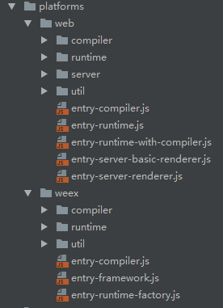

# 了解 Vue 这个项目
  ## 运行的环境以及输出不同版本的vue  
  
  
  从图中可以看出,分别运行于web和weex两种不同的环境;这里主要将web端的。
  
  在web端可以看到分为了运行时版和完整版(运行时版 + 编译),因为编译是可以单独抽出来,比如我们的单文件(.vue)就是需要编译的,
  但如果你是用render函数写的就不需要了。在这里主要将的是完整版的也就是entry-runtime-with-compiler.js